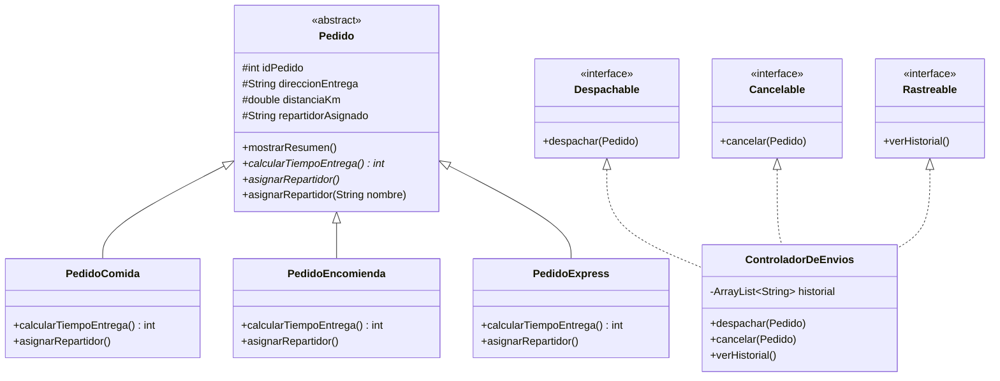

# Diagrama de Clases - Sistema SpeedFast

## Justificación de diseño

- **Abstracción (clase `Pedido`)**: centraliza atributos y comportamiento común, evitando duplicación de código y facilitando el mantenimiento — un cambio en `mostrarResumen()` afecta a todas las subclases sin tocarlas.
- **Polimorfismo (sobrescritura de `asignarRepartidor()` y `calcularTiempoEntrega()`)**: permite tratar distintos tipos de pedido de forma uniforme (por ejemplo, en un `ArrayList<Pedido>`), delegando el comportamiento específico a cada subclase.
- **Interfaces (`Despachable`, `Cancelable`, `Rastreable`)**: desacoplan responsabilidades funcionales de la jerarquía de pedidos, permitiendo agregar nuevas operaciones (como notificaciones o pagos) sin modificar las clases de `Pedido`.
- **Escalabilidad**: agregar un nuevo tipo de pedido (ej. `PedidoFarmacia`) solo requiere heredar de `Pedido` e implementar los métodos abstractos, sin alterar el resto del sistema.
